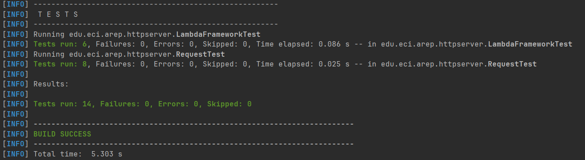
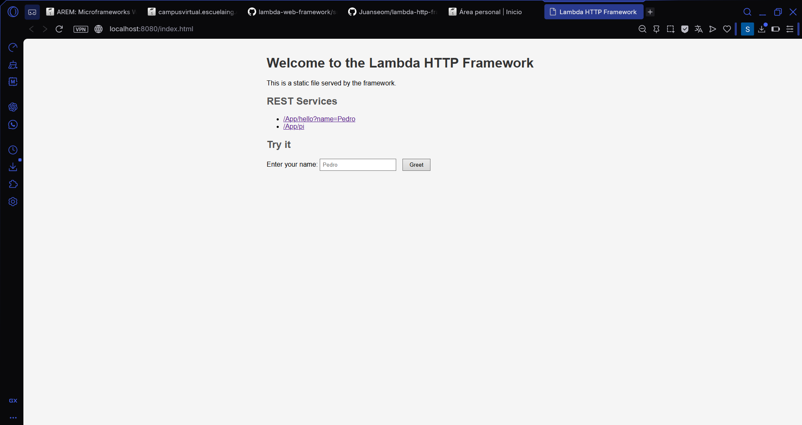
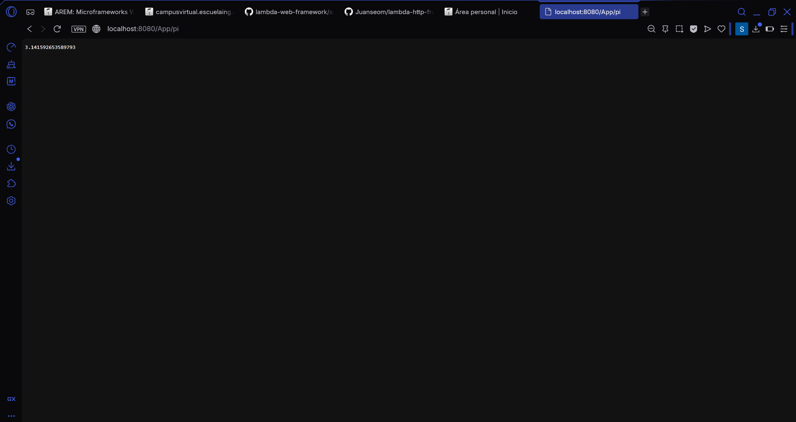
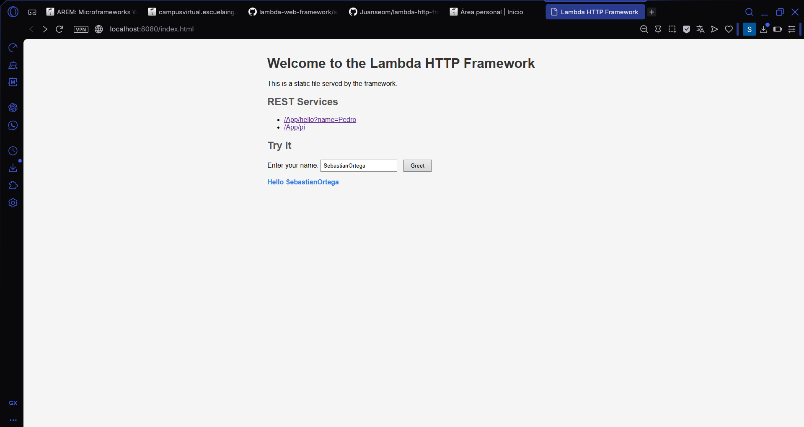

# Lambda HTTP Framework

A lightweight web framework built in Java that allows developers to create REST services using lambda functions and serve static files. The server handles HTTP requests, supports query parameter extraction, and serves HTML, CSS, JavaScript, and image files.

## Author

Juan Sebastian Ortega Muñoz

## Architecture

The project follows a simple design with 6 classes:

```
edu.eci.arep.httpserver
├── App.java             - Example application that uses the framework
├── HttpServer.java      - HTTP server that listens for connections and handles requests
├── LambdaFramework.java - Core framework that stores routes and static file config
├── Request.java         - Represents an HTTP request with query parameter parsing
├── Response.java        - Represents an HTTP response
└── RouteHandler.java    - Functional interface for lambda-based route handlers
```

### How it works

1. **HttpServer** opens a `ServerSocket` on port 8080 and waits for connections in a loop.
2. When a request arrives, it reads the HTTP request line (e.g., `GET /App/hello?name=Pedro HTTP/1.1`).
3. If the path starts with `/App`, it looks for a registered REST route in **LambdaFramework** and executes the lambda handler.
4. If the path does NOT start with `/App`, it looks for a static file in the configured folder using `getResourceAsStream()`.
5. **Request** parses the query string (e.g., `name=Pedro&age=20`) into a `Map` so values can be accessed with `getValues("name")`.
6. **RouteHandler** is a `@FunctionalInterface` that lets developers define routes with lambda expressions.

### Architecture Diagram

```
Browser Request
      |
      v
  HttpServer (port 8080)
      |
      ├── Path starts with /App? ──> YES ──> LambdaFramework.getHandler()
      |                                          |
      |                                          v
      |                                    RouteHandler.handle(req, res)
      |                                          |
      |                                          v
      |                                    Response (text/plain)
      |
      └── Path does NOT start with /App? ──> Serve static file
                                                  |
                                                  v
                                            target/classes/webroot/
                                            (HTML, CSS, JS, images)
```

## Features

### 1. GET Method for REST Services

The `get()` method allows you to define REST services using lambda functions:

```java
get("/hello", (req, res) -> "Hello World!");
```

This maps the URL `/App/hello` to a lambda that returns `"Hello World!"`.

### 2. Query Value Extraction

The `Request` class parses query parameters and makes them accessible with `getValues()`:

```java
get("/hello", (req, res) -> "Hello " + req.getValues("name"));
```

When you visit `http://localhost:8080/App/hello?name=Pedro`, it returns `Hello Pedro`.

### 3. Static File Location

The `staticfiles()` method defines where static files are located:

```java
staticfiles("/webroot");
```

The framework looks for files in `target/classes/webroot/`. It supports HTML, CSS, JS, PNG, JPG, and GIF files.

### 4. Example Application

The `App.java` class shows how a developer would use the framework:

```java
public static void main(String[] args) throws Exception {
    staticfiles("/webroot");
    get("/hello", (req, res) -> "Hello " + req.getValues("name"));
    get("/pi", (req, res) -> {
        return String.valueOf(Math.PI);
    });

    HttpServer.main(args);
}
```

The static web page (`index.html`) includes links to the REST services and has an interactive form that calls the `/App/hello` service using JavaScript `fetch()`.

## Prerequisites

- Java 17
- Maven
- Git

## Installation and Usage

1. Clone the repository:

```bash
git clone https://github.com/Juanseom/lambda-http-framework.git
cd lambda-http-framework
```

2. Compile the project:

```bash
mvn clean compile
```

3. Run the server:

```bash
java -cp target/classes edu.eci.arep.httpserver.App
```

4. Open your browser and visit:

- **Static page:** [http://localhost:8080/index.html](http://localhost:8080/index.html)
- **Hello service:** [http://localhost:8080/App/hello?name=Pedro](http://localhost:8080/App/hello?name=Pedro)
- **Pi service:** [http://localhost:8080/App/pi](http://localhost:8080/App/pi)

## Running Tests

Run the automated tests with:

```bash
mvn test
```

The project has 14 automated tests that verify:

- Query parameter parsing (single param, multiple params, missing param, empty query, null query)
- Route registration and handler execution
- Routes with query parameters
- Non-existent route handling
- Static file path configuration
- Pi route calculation

### Test Results



## Evidence of Tests

### Static Page (index.html)



### Hello Service with Query Parameter


### Pi Service



### Interactive Form


